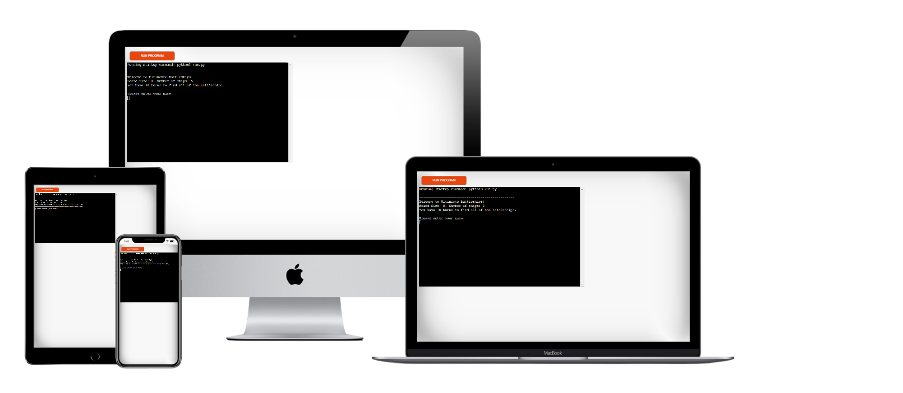

# Ultimate Battleships Game in Python
## Portfolio Project 3 - Code Institute
Ultimate Battleships is a Python terminal game I created for my Portfolio Project 3 for my Bootcamp at Code Institute. 
The Ultimate Battleship Game runs in the Code Institute mock terminal on Heroku.
The users have 10 turns to find all of the computer’s battleships before the computer finds theirs. Each battleship occupies one space on the board.

You can view the project [here](https://battleshipsgame-project.herokuapp.com/)

### How to play
Ultimate Battleship is based on the classic pen-and-paper game. You can read more about it in [Wikipedia](https://en.wikipedia.org/wiki/Battleship_(game)).
The player enters their name in this version, and two boards are randomly generated.
The player's ships are located on the first board, which the computer needs to find.
The second board is the computer's board, where the player's guesses will be shown. 
The ship locations will never be revealed unless the player hits the battleships.
The symbols that will display are
- "-"When the player or the computer missed the battleship
- "X "when a battleship has been hit by the player or the computer.
The player and the computer have 10 turns to find and hit all the ships. Whoever hits and syncs all opponent's battleships first is the winner.
If no one managed to synch all the battleships in the 10 rounds, no one wins, and the game is over.

## User Stories
Ultimate Battleships was created using Python, where the user challenges the computer. The following points describe the display of the game:
* Welcome message to the user, displaying the number of ships, board size and the number of turns
* Following by asking the user to input his/her name
* The user's board is displayed with their battleship locations for the computer to guess
* The computer's board is displayed for the user to guess the computer's battleship locations
* Then the user inputs their guess for row
* Ensuring their input is validated
* Then, the user inputs their guess for the column
* Ensuring their input is validated
* User's guesses are checked against the hidden board
* A message is displayed to the user, mentioning if their guess was a hit or a miss
* Th computer's guesses are randomly generated
* The computer's guesses are also checked against the user's board
* A message is displayed to the user, mentioning if the computer guess was a hit or miss
* The user's and computer's scores are calculated and printed to the terminal
* The turns remaining are calculated and printed to the terminal
* A continue playing option is displayed for the user to input y/n
* The user's board is updated with hit or miss and re-printed
* The computer's board is updated with hit or miss and re-printed
* If the user has hit 5 ships, a message for winning the game and the end game is displayed
* If the computer has hit 5 ships, a message for losing the game and the end game is displayed
* If the user has run out of turns, a message and end game is displayed

## Features
### Existing Features
* Random board generation for user board which places ships on the board
* Random board generation for hidden board which places ships on a board which the user cannot see
* Play against the computer
* Accepts user input for Name, Row and Column
* Maintains scores
* Input validation and error-checking
    * The user cannot enter coordinates outside of the grid
    * The user cannot enter the same coordinates twice
    * The user must enter a number between 1-8 for rows
    * The user must enter a letter between A-H for columns
* Randomly creates the computer guesses

In this game of Battleships, the player and computer each have up to 10 turns to find the opponents 5 battleships, and the winner if whoever finds all 5 first.

There are three boards, the Player's Board and the Computer's Board which are both displayed, and a hidden board which holds the position of the computer's battleships which the player needs to find.

Each  board has 8 rows and 8 columns, the rows are 1 to 8, and the columns are A to H, and each cell contains a space.

Each battleship occupies one cell, and before the game starts, the computer generates the position of 5 battleships that the player and computer need to find to win, and populates the player and hidden boards with them by replacing the space with a "@". The computer board is left blank so that the player cannot see the computers choices.

The Player enters a ship row and column, and the computer generates a ship row and column. 

If the player row and column does not find a battleship on the computers hidden board, the message "Sorry you missed" is displayed and the cell of the displayed computer board is populated with a -.

If the player row and column does find a battleship on the computers hidden board, the message "congratulations you have hit the battleship" is displayed and the cell of the displayed computer board is populated with an X.

The computers generated row and column are displayed.

If the computer row and column does not find a battleship on the players board, the message "Phew the computer missed" is displayed and the cell of the players board is replaced with an -.

If the computer row and column does find a battleship on the players board, the message "your battleship has been hit" is displayed and the @ in the cell is replaced with an X.

After each turn, the number of turns remaining is displayed and control returns for the player to enter their next row and column if the turns are under 10.

### Future Features
* Allow the user to select the board size
* Allow the user to select the number of ships
* Allow the user to position the ships themselves
* Have ships larger than 1x1
* Different game modes
    * Not limited to 10 turns
    * Option to select how many turns you would like

## Testing
I have manually tested this project by doing the following:
* Run the code through the PEP8 validator and confirmed there are no problems
* Tested in the terminal on Gitpod and the Code Institute Heroku Terminal

When the game is loaded the game name, welcome message, game instructions and user's name input field are displayed correctly.
* Display game name
* Display game info
* User inputs name

When the user inputs their username this is checked for empty data input and an error message will appear until a name has been entered.

When the user inputs their name two boards are created, one for the user and their ships and another board for the computer which is blank for the user to guess the computers ships.
* User board displayed with ship locations for the computer to guess
* Computer board displayed for the user to guess the computers ship locations

When the user inputs a row number this is validated to see if it is a number between 1-8. I have tested the validation by using a number outside of the range, a letter, a word, space and enter and the data validation error message displays until the correct input type has been entered.
* User inputs guess for row
* User input validated for correct input

When the user inputs a column letter this is validated to see if it is a letter between A-H. I have tested the validation by using a letter outside of the range, a word, a number, space and enter and the data validation error message displays until the correct input type has been entered.
* User inputs guess for column
* User input validated for correct input

Once the user has input the row and column coordinates, these are checked against the HIDDEN_BOARD to see if the user has hit or missed. A message is printed to the user with the hit or miss result. The computers guess is randomly generated and checked against the user's board and a message to the user is displayed with the hit or miss result. A message with the computers guess coordinates are printed to the user. The turns remaining is display as well as the user's and computer's scores. Message is displayed to the user asking if they want to continue playing.
* User’s input coordinates are checked against the hidden board
* Message to user to display if their guess was a hit or a miss
* Computers guesses are randomly generated
* Computers guesses are checked against the user board
* Message to user to display if the computer guess was a hit or miss
* User and computer scores calculated and printed to terminal
* Turns remaining calculated and printed to the terminal
* Continue playing option for the user to input y/n

The user's input for the continue playing option is validated to see if it is "y", "yes", "n" or "no". I have tested the validation by entering a letter, a word, space and enter and the data validation error message displays until the correct input type has been entered.

If the user inputs n or no a message is displayed and the game ends.

If the user inputs y or yes a message is display and the game continues.

When the user hits a ship the correct message is displayed and their score is incremented by 1.

When the computer hits a ship the correct message is displayed and their score is incremented by 1.

The users board and computer board are updated with the guesses and reprinted. The game continues until the user either quits, the user hits all 5 ships, the computer hits all 5 ships or the user has run out of turns.
* Users board updated with hit or miss and re-printed
* Computers board updated with hit or miss and re-printed

When the user hits all 5 ships a message is display and the game finishes.
* If user has hit 5 ships display message for winning game and end game

In the github terminal I changed turns from 10 to 80 in the run_game function to test if the computer could win the game when not restricted to 10 turns. I was unable to test this successfully as there is a bug which has been documented in the bugs section.
* If computer has hit 5 ships display message for losing game and end game

* If user has run out of turns display message and end game

### Bugs
The computer guesses were not being updated on the user's board but I had noticed that I was not calling the correct variable names. This has now been corrected and the boards are being updated as expected.

When the user had ran out of turns the continue playing option was being shown instead of the game ending. This was due to the continue playing if statement appearing first in the while loop and has now been fixed.

When testing the game I have noticed that sometimes the computer guess is not generated and the messages are not printed to the screen. I have tested this several times and I have not been able to find any logic in why this is happening as it seems to be at random times. I have documented the testing I have completed so far in the file below.

[testing_computer_guess_not_generated.txt](https://github.com/Lucy-Glanville-Brown/battleships/files/7360924/testing_computer_guess_not_generated.txt)

### Validator Testing
PEP8

## Deployment
This project was deployed using Code Institute's mock terminal for Heroku.
* Fork or Clone this repository
* Create new Heroku app
* You will need to add PORT 8000 to Config Vars in the Settings tab
* Set the buildbacks to Python and NodeJS in that order
* In the Deployment tab select GitHub as the Deployment method
* Link the Heroku app to the repository
* Click on Deploy

## Credits
* Code Institute for the deployment terminal
* Knowledge Mavens for the YouTube video How to Code Battleship in Python - Single Player Game. [Knowledge Mavens Video](https://www.youtube.com/watch?v=tF1WRCrd_HQ)
* The battleships text in ascii was created using an ascii generator found [here](https://patorjk.com/software/taag/#p=display&f=Doom&t=Battleships)
* The battleship image in ascii was taken from [here](https://www.asciiart.eu/vehicles/navy)
* After running the code through the PEP8 validator I had a lot of errors for the lines being too long which I found help on stack overflow [here](https://stackoverflow.com/questions/3346230/wrap-long-lines-in-python/18160132)
* PEP8 validator error local-variable-referenced-before-assignment I also found help on stack overflow [here](https://stackoverflow.com/questions/10851906/python-3-unboundlocalerror-local-variable-referenced-before-assignment)
* Another error I had after using PEP8 was that my if statement line was too long, I found help on stackoverflow and flake8rules
[stackoverflow](https://stackoverflow.com/questions/5253348/very-long-if-statement-in-python)
[flake8rules](https://www.flake8rules.com/rules/E129.html)

## Acknowledgements
The basic layout of the code was written by following along with the Knowledge Mavens YouTube video on How to Code Battleship in Python - Single Player. I used Repl to code along with the video and the original code can be found [here.](https://replit.com/@lucygbrown/battleships#main.py)

I watched this video several times and made notes as I was going along to break down each step. This video was just for a single player so I have created another board which shows the users board with ships for the computer to guess, which makes this a two player game. I have also added data validation for the input of the row and column coordinates as well as a continue playing option. 

The code that I have added is:
* USER_BOARD
* numbers_to_letters
* user_score
* computer_score
* computer_guess(board)
* validate_row(values)
* validate_column(values)
* main()
    * Battleships ascii text
    * Battleship ascii art
    * username input
* validate_continue_playing()
* run_game()
    * Updated the printed messages to f strings to include the user's name
    * Print the USERS_BOARD
    * Added computer_guess(USERS_BOARD) to the if statements for if the ship location was a hit or miss
    * Added continue playing option and if statements

My mentor Nishant Kumar suggested adding colour to the game which was found on Geeks for Geeks website [here.](https://www.geeksforgeeks.org/print-colors-python-terminal/)