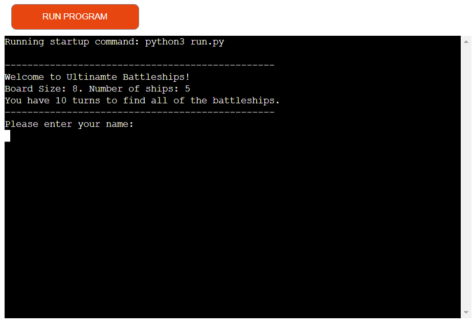
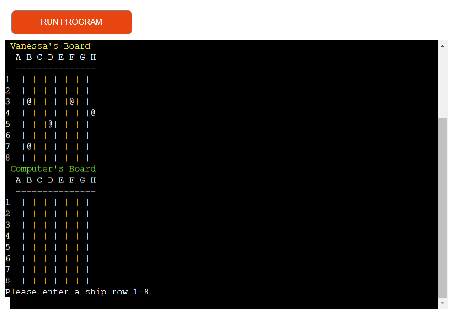
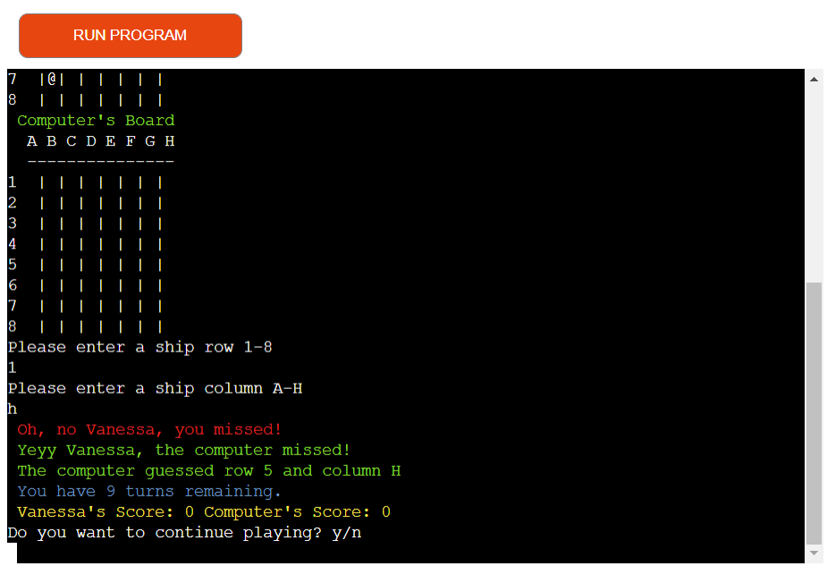
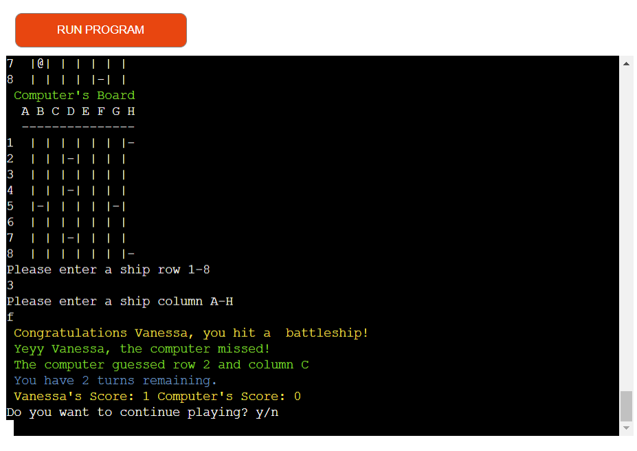
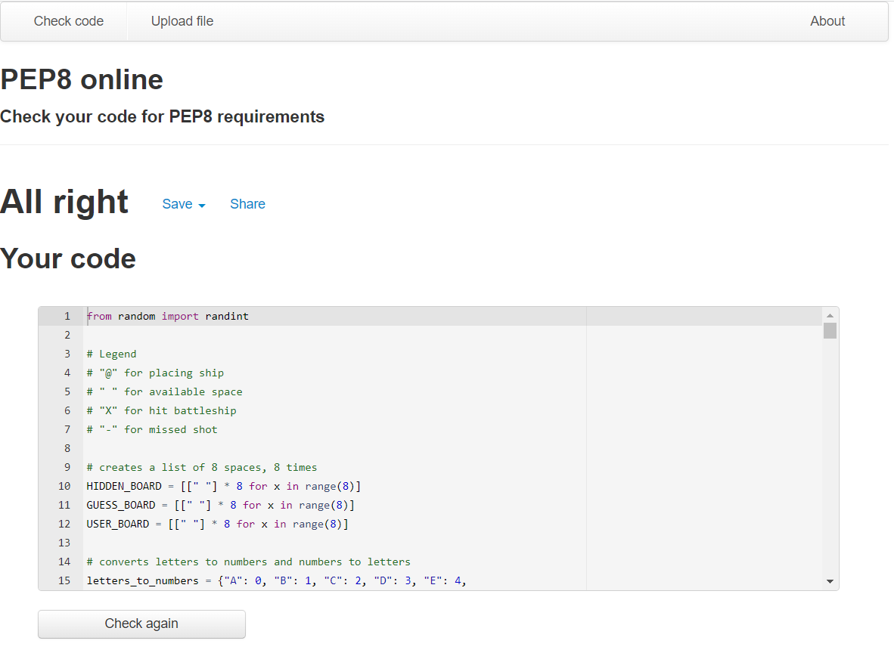

# Ultimate Battleships Game in Python
## Portfolio Project 3 - Code Institute
Ultimate Battleships is a Python terminal game I created for my Portfolio Project 3 for my Bootcamp at Code Institute. 
The Ultimate Battleship Game runs in the Code Institute mock terminal on Heroku.
The users have 10 turns to find all of the computer’s battleships before the computer finds theirs. Each battleship occupies one space on the board.

You can view the project [here](https://battleshipsgame-project.herokuapp.com/)

### How to play
Ultimate Battleship is based on the classic pen-and-paper game. You can read more about it in [Wikipedia](https://en.wikipedia.org/wiki/Battleship_(game)).
The player enters their name in this version, and two boards are randomly generated.
The player's ships are located on the first board, which the computer needs to find.
The second board is the computer's board, where the player's guesses will be shown. 
The ship locations will never be revealed unless the player hits the battleships.
The symbols that will display are
- "-"When the player or the computer missed the battleship
- "X "when a battleship has been hit by the player or the computer.
The player and the computer have 10 turns to find and hit all the ships. Whoever hits and syncs all opponent's battleships first is the winner.
If no one managed to synch all the battleships in the 10 rounds, no one wins, and the game is over.

## User Stories
Ultimate Battleships was created using Python, where the user challenges the computer. The following points describe the display of the game:
* Welcome message to the user, displaying the number of ships, board size and the number of turns
* Following by asking the user to input his/her name
* The user's board is displayed with their battleship locations for the computer to guess
* The computer's board is displayed for the user to guess the computer's battleship locations
* Then the user inputs their guess for row
* Ensuring their input is validated
* Then, the user inputs their guess for the column
* Ensuring their input is validated
* User's guesses are checked against the hidden board
* A message is displayed to the user, mentioning if their guess was a hit or a miss
* Th computer's guesses are randomly generated
* The computer's guesses are also checked against the user's board
* A message is displayed to the user, mentioning if the computer guess was a hit or miss
* The user's and computer's scores are calculated and printed to the terminal
* The turns remaining are calculated and printed to the terminal
* A continue playing option is displayed for the user to input y/n
* The user's board is updated with hit or miss and re-printed
* The computer's board is updated with hit or miss and re-printed
* If the user has hit 5 ships, a message for winning the game and the end game is displayed
* If the computer has hit 5 ships, a message for losing the game and the end game is displayed
* If the user has run out of turns, a message and end game is displayed

## Features
### Existing Features
The usera has to enter their name first.

A random board is displayed for the user's board and place their ships. A random board is shown with hidden ships for the computer, so the user cannot visualise it. 

Then, the user can start playing against the computer and has to add Rows Number and Column Letter. Then the computer randomly chooses its coordination. During the game, the scores are maintained, and validation and error-checking are displayed whiles:
- The User cannot enter guesses outside of the board
- The User cannot enter the same guesses twice
- The User must enter a number between 1-8 for rows
- The User must enter a letter between A-H for columns

In this game of Ultimate Battleships, both the player and computer have up to ten turns to find the opponent's five battleships. Whoever manages to sink the five battleships before ten turns is the winner. If no one syncs them all in ten turns, then the game is over, and there is no winner.

There are three boards, where two of them are displayed. The Player's Board and the Computer's Board. One hidden board holds the position of the computer's battleships the player needs to find.

Each board has 8 rows and 8 columns; the rows are 1 to 8, the columns are A to H, and each cell contains a space.

Each battleship occupies one cell, and before the game starts, the computer generates the position of the five battleships. The player and computer need to find them to win and populate the player and hidden boards with them by replacing the space with a "@". The computer board is left blank so that the player cannot see the choices of the computer.

The player enters a ship row and column, and the computer generates a ship row and column. 

If the player row and column do not find a battleship on the hidden computer board, the message "Oh, no, you missed!" is displayed. The cell of the displayed computer board is populated with a -.

Suppose the player row and column find a battleship on the computer's hidden board. In that case, the message "Congratulations, you hit a  battleship!" is displayed. The cell of the displayed computer board is populated with an X.

The computers generated row and column are displayed.

If the computer row and column do not find a battleship on the player's board, the message "Yeyy, the computer missed!" is displayed. The cell of the player's board is replaced with an -.

If the computer's row and column guess find a battleship on the player's board, "Oh no, your battleship has been hit!" is displayed. The @ in the cell is replaced with an X.

After each turn, the number of turns remaining is displayed, and control returns for the player to enter their next row and column if the turns are under 10.

### Future Features
In future features, the Ultimate Battleships game should contain:
- Game difficulty
  - Choosing the number of turns
  - Choosing the number of ships
  - Board size choice
- Positioning the ships wherever the user wants

## Testing
I have manually tested this project by doing the following:
* Run the code through the PEP8 validator and confirm there are no problems
* Given invalid inputs: strings when numbers are expected, out of bonus inputs, same input twice, no input
* Tested in the terminal on Gitpod and the Code Institute Heroku Terminal

### Bugs
I initially wanted to create a smaller grid (5*5) with three ships and seven rounds when using Mavens code. When I changed to that numbers, the game was not running. After six tries to understand what was wrong, I changed it to what Maven referred to in his video: eight rows and columns, five ships and ten turns. 

### Remaining Bugs
No bugs remaining.

### Validator Testing
[PEP8](http://pep8online.com/checkresult)

## Deployment
This project was deployed using Code Institute's mock terminal for Heroku.
* Fork or Clone this repository
* Create new Heroku app
* You will need to add PORT 8000 to Config Vars in the Settings tab
* Set the buildbacks to Python and NodeJS in that order
* In the Deployment tab select GitHub as the Deployment method
* Link the Heroku app to the repository
* Click on Deploy

## Credits
* Code Institute for the deployment terminal
* [Wikipedia](https://en.wikipedia.org/wiki/Battleship_(game)) for the details of the Battleships game
* Mavens YouTube video, implementing a single player in Battleship using python. The YouTube video is called _How to Code Battleship_ and can be watched [here](https://www.youtube.com/watch?v=tF1WRCrd_HQ). I used the layout of the code that is available [here.](https://replit.com/@lucygbrown/battleships#main.py)
* [PEP8](http://pep8online.com/checkresult) for checking my code for PEP8 requirements
* [Geeks for Geeks](https://www.geeksforgeeks.org/print-colors-python-terminal/) for adding colour to some of the text in the game